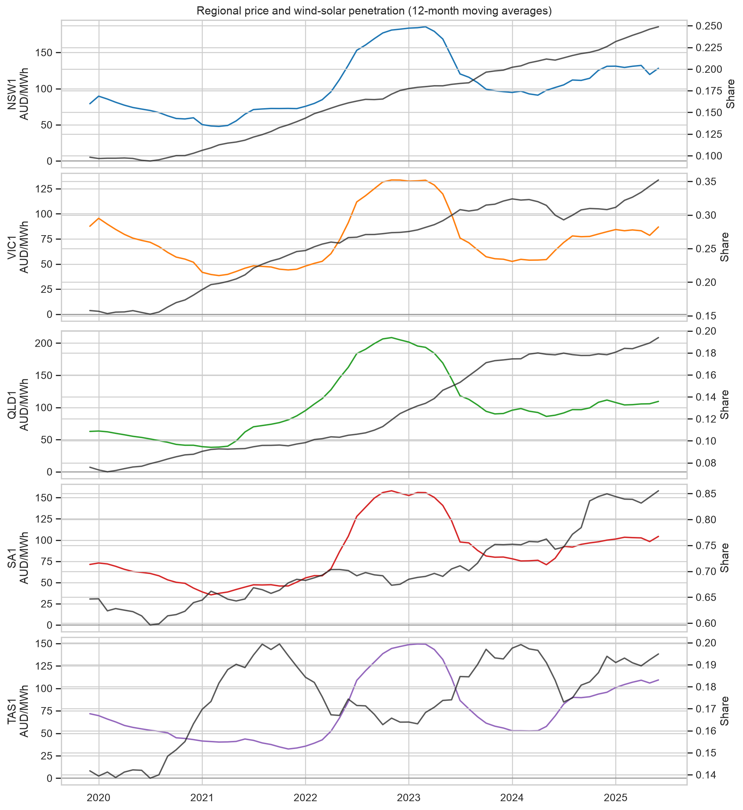
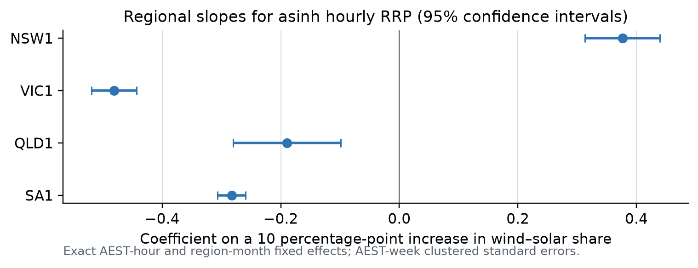
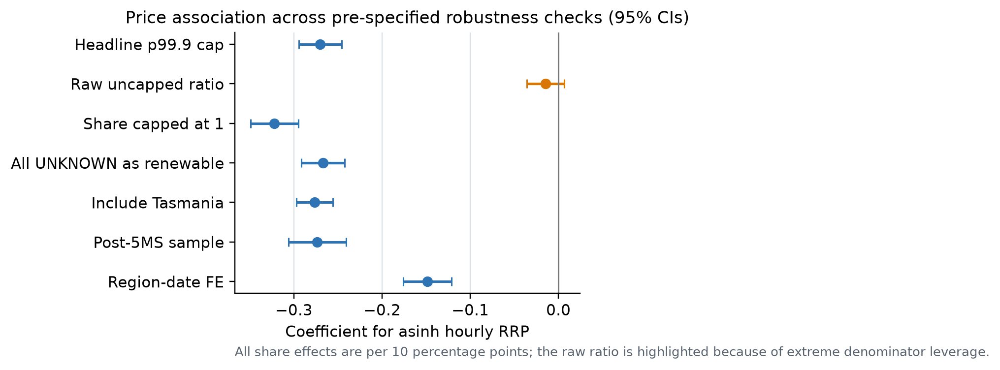

<p align="center">
  🇨🇳 中文 &nbsp;|&nbsp; 🌍 <a href="README_EN.md">English</a>
</p>

# 可再生能源渗透率、批发电价与波动：澳大利亚 NEM

## 项目目标

本项目研究可再生能源发电渗透率是否与澳大利亚国家电力市场（NEM）各区域更低的批发电价、不同的价格波动和更高的负电价风险相关。主要分析区域为 NSW1、VIC1、QLD1 和 SA1，并将 TAS1 留作稳健性检验。

研究构建了一个可复现的“区域—时间”面板：研究期为 2019 年 7 月 1 日至 2025 年 6 月 30 日，将 5 分钟调度数据聚合为小时观测。样本跨越 2021 年 10 月 1 日的五分钟结算（5MS）转换，因此也能检验转换前后、季节以及峰谷时段的异质性。

## 研究问题

1. 更高的风电与公用事业级太阳能渗透率是否与更低的区域批发电价相关？
2. 它是否改变价格波动或负区域参考电价出现的概率？
3. 这种关系是否在 NSW、VIC、QLD 和 SA 之间不同？
4. 这种关系是否随季节及峰谷时段变化？

## 项目状态

**已完成的研究项目。** 仓库包含经核验的 FY2020–FY2025 AEMO 源数据历史、可复现的 5 分钟至小时面板、冻结的计量设计、核心与稳健性估计、发表级图表、一份 10 页英文研究报告，以及静态看板。全新环境复现审计已核验来源校验和、面板、表格、图形、Notebook 与报告，详见[复现审计](docs/task11_reproducibility_audit.md)。

本研究最重要的计量风险是内生性：实际可再生出力、需求、机组故障、网络约束、报价和价格由共同机制决定。因此，所有结果均表述为**条件相关性**，而非因果效应。识别审计表明，天气同时影响需求和屋顶光伏，且缺少电厂加权工具变量及排除限制审计，因此不支持简单的天气 IV 因果主张。

最终交付为 [英文研究报告](report/AU_NEM_Renewables_Prices_Research_Report.docx)，由 [Markdown 源文件](report/research_report.md) 生成。已经实际执行并保存输出的[最终结果 Notebook](notebooks/03_final_results.ipynb)提供结果表、可复现性检查和图形。[静态看板源码](site/)以不公开原始研究数据的方式呈现冻结的主结果、区域异质性和稳健性证据。配套材料包括[冻结计量设计](docs/task7_econometric_specification.md)、[核心估计备忘录](docs/task8_core_estimation.md)、[稳健性与识别审计](docs/task9_robustness_identification_audit.md)、[数据来源](docs/data_sources.md)、[变量字典](docs/variable_dictionary.md)和[数据说明](data/README.md)。

## 主要结果

在合并样本 p99.9 截尾后的“风电 + 公用事业级太阳能占需求比”每提高 10 个百分点时：

- 小时 RRP 平均低 **A$11.80/MWh**（标准误 A$0.87/MWh）；
- 一小时内任一 5 分钟价格为负的概率高 **3.58 个百分点**（标准误 0.14 个百分点）；
- 小时内 5 分钟 RRP 标准差低 **A$5.03/MWh**（标准误 A$0.68/MWh）。

这些模式在主要样本、燃料映射、固定效应和协方差设定检查中，在经济上常见的样本支持范围内均能保持。未截尾的需求比率是一个已记录的失败设定：少数 SA1 近零需求小时会造成极端杠杆。区域斜率也有显著差异（NSW1 的变换价格斜率为正），所以合并系数不能被解读为普遍适用的州级效应。

## 关键图形证据



*图 1. FY2020–FY2025 各区域月度 RRP 与风电加公用事业级太阳能占比。*



*图 2. 冻结设定下的区域条件相关性。*



*图 3. 电价结果在预设样本、映射、固定效应和协方差估计量下的稳健性。*

## 仓库结构

```
config/       分析选择、区域代码、映射和来源 URL
data/         原始/中间/处理后数据及可追溯的数据说明
docs/         可行性备忘录、来源清单和变量字典
notebooks/    探索性与最终分析 Notebook
outputs/      生成图形与可提交的紧凑结果表
provenance/   可提交的来源 URL、版本和 SHA-256 清单副本
report/       最终英文报告、Markdown 源与可复现 DOCX 构建输入
site/         静态交互看板、紧凑公开数据载荷和本地预览说明
src/          可复现的下载、面板构建和估计模块
tests/        数据质量与转换测试
```

## 已完成的工作流

1. 下载 AEMO 月度调度、SCADA、机组注册和燃料数据。
2. 将来源时间戳标准化为固定 NEM 市场时间（`Australia/Brisbane`，AEST/UTC+10）；仅为异质性分析派生州本地时钟，并将 5 分钟数据聚合到小时。
3. 构建区域可再生能源占比、需求控制变量和燃料映射诊断。
4. 完成双向固定效应、分布滞后、负电价 Logit/Probit、预先指定的异质性与稳健性检验。
5. 导出发表级表格/图形，并撰写 8–10 页英文报告。

在识别审计后，天气 IV 估计被明确排除。完整样本的无惩罚 q = 0.50、0.90 和 0.95 分位数模型在受限计算时间内未完成，因此透明地省略，而没有以不同估计量替代。

## 构建状态

最终报告渲染为 10 页，包含经济学解释、主结果表、区域异质性、稳健性图、局限性和参考文献。看板是自包含的静态网页，数据由本地文件提供且不依赖第三方图表服务；详见[看板说明](docs/task12_dashboard.md)。仓库也包含 GitHub Pages 发布工作流。

## 环境与复现

所有命令均使用项目本地虚拟环境 `.venv`。先在其中安装最小构建栈；完整的计量和报告依赖由 `requirements.txt` 管理。不得向系统 Python 安装任何项目包。

```bash
python3 -m venv .venv
.venv/bin/python -m pip install --upgrade pip
.venv/bin/python -m pip install -r requirements.txt
.venv/bin/python -m pytest -q
.venv/bin/python -m src.duid_mapping
.venv/bin/python -m src.panel_builder
.venv/bin/python -m src.specification_audit
.venv/bin/python -m src.core_estimation
.venv/bin/python -m src.nonlinear_estimation
.venv/bin/python -m src.summarise_task8
.venv/bin/python -m src.robustness_estimation
.venv/bin/python -m src.heterogeneity_inference
.venv/bin/python -m src.bootstrap_inference
.venv/bin/python -m src.task9_data_audit
.venv/bin/python -m src.summarise_task9
.venv/bin/python -m src.report_figures --root .
.venv/bin/python -m src.build_research_report --source report/research_report.md --output report/AU_NEM_Renewables_Prices_Research_Report.docx --root .
.venv/bin/jupyter-nbconvert --to notebook --execute --inplace notebooks/03_final_results.ipynb
.venv/bin/python -m src.reproducibility_audit --root . --full-checksums
.venv/bin/python -m src.build_dashboard_data --root .
.venv/bin/python -m http.server 8000 --directory site
```

## 冻结的主规格

对区域 `r` 和小时 `t`：

`g(price_rt) = beta * renewable_share_rt + demand_controls_rt + region_month_FE + exact_AEST_hour_FE + error_rt`

首选价格结果为 `asinh(RRP)`，以允许区域参考电价为负。结果变量也包括小时内 5 分钟价格离散度和负电价指标。主规格标准误按 AEST ISO 周聚类（314 个聚类）；稳健性分析还报告 168 小时 Driscoll–Kraay 协方差及 AEST 周 score-multiplier 审计。

## 可复现性

仓库有意不提交大型市场原始数据。下载器会在 manifest 中记录来源 URL、下载时间、校验和和数据版本；可提交的冻结副本位于 [`provenance/`](provenance/)，紧凑最终结果表位于 `outputs/tables/`。完整的原始数据重建仍需要约 1.98 GB 压缩 AEMO 来源文件。只在项目 `.venv` 内安装依赖；AEMO 和其他来源数据仍受各自使用条款约束。

## 数据来源

- [AEMO NEM 数据概览](https://www.aemo.com.au/energy-systems/electricity/national-electricity-market-nem/data-nem)
- [AEMO MMS 调度文档](https://www.aemo.com.au/energy-systems/electricity/national-electricity-market-nem/data-nem/market-management-system-mms-data/dispatch)
- [澳大利亚气象局 Climate Data Online](https://www.bom.gov.au/climate/cdo/)

## 许可与数据使用

本仓库目前未附加开源许可证；除非以后明确加入 `LICENSE`，代码再利用权不作授权。原始来源数据仍受 AEMO 和其他来源各自的条款约束。
